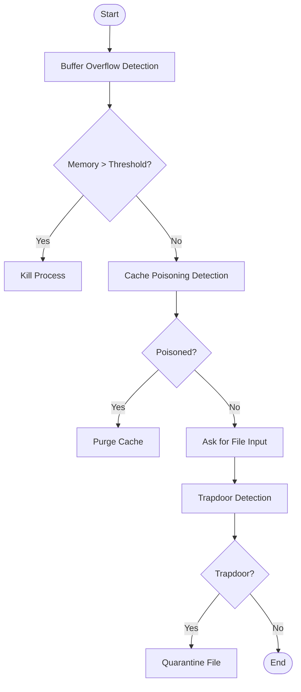

# AegiScan – Security Vulnerability Detection Framework

AegiScan is a modular security framework designed to detect and mitigate system-level vulnerabilities in real-time. It focuses on identifying three key threats: **Buffer Overflows**, **Trapdoors**, and **Cache Poisoning**, using Python-based monitoring and mitigation techniques. The framework is lightweight, containerized, and designed with extensibility in mind.

---

##  Features

-  **Buffer Overflow Detection** via memory usage monitoring
-  **Trapdoor Detection** by scanning binary files for hidden behavior
-  **Cache Poisoning Detection** with URL poisoning simulations
-  Built-in mitigation strategies like file quarantine and cache purging
-  Log-based event tracking for all detections
-  Modular architecture for easy expansion

---

## 🧩 Module-Wise Breakdown

### 1. `buffer_detector.py`
Monitors active processes using `psutil` to detect unusually high memory usage (potential buffer overflow). Terminates suspicious processes.

### 2. `trapdoor_detector.py`
Scans binary files for trapdoors using predefined byte patterns and characteristics. Supports quarantine of affected files.

### 3. `cache_poisoning_detector.py`
Simulates poisoned cache requests and checks server responses. Flags anomalies and allows cache purging.

### 4. `main.py`
Coordinates the detection flow: runs buffer checks, asks user input for file scan, and checks for cache poisoning.

### 5. `utils.py`
Logs all events in a JSON-based structure for future audits or analysis.

---

## 🛠️ Technologies Used

### Programming Language:
- Python 3.13

### Libraries & Tools:
- `psutil`, `hashlib`, `os`, `datetime`, `json`, `requests`

### Other Tools:
- GitHub (Version Control)
- Docker (Containerization)

---

## 📊 Flow Diagram

 ##  Docker Integration

    AegiScan is Docker-ready and can be tested in a containerized environment. This ensures portability and isolation across systems.
    Dockerfile Highlights:
      Uses python:3.13-slim base image
      Runs app as a non-root user
      Logs and binaries are mounted inside container
      Drops Linux capabilities at runtime for security
